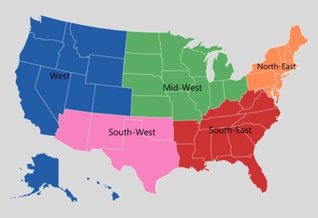
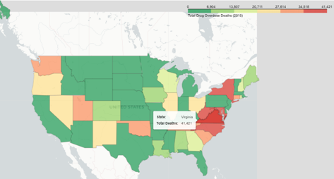
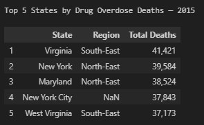
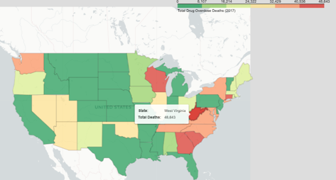
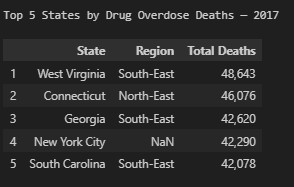
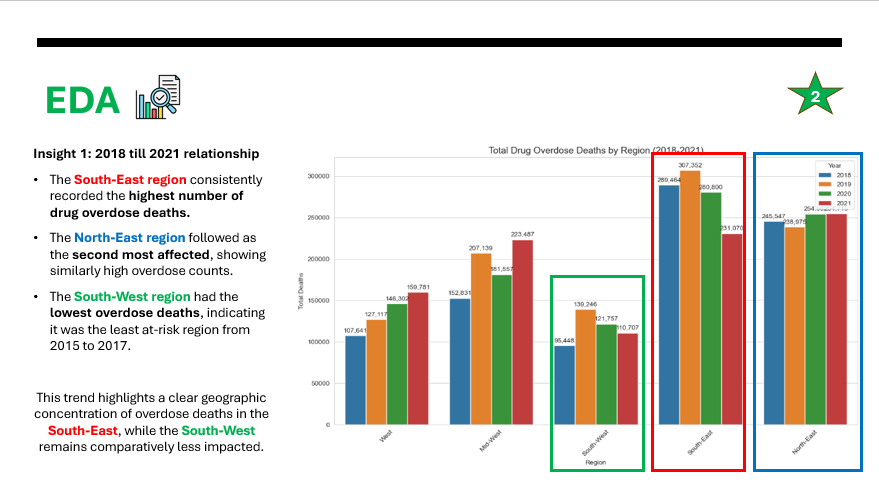
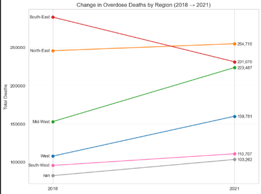
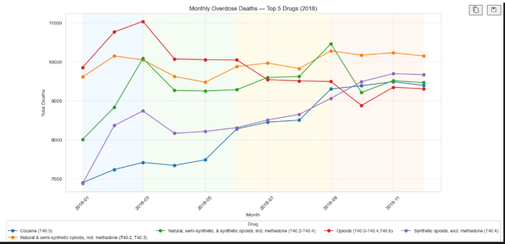
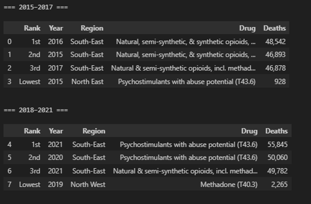

# 💊 Drug Overdose Deaths in the U.S. — Exploratory Data Analysis (EDA)
**IOD (Institue of Data) Mini Project 1** aims to perform data analytics on U.S. drug overdose deaths to uncover key trends, patterns, and insights within the dataset.
The project focuses on identifying how factors such as year, state, and drug type influence mortality rates and overall public health outcomes.

## Project Resources:
- 🎞️ **Video Presentation: (update in progress)** [Watch Here](video_presentation.mp4)
- 🖼️ **Presentation:** [View Slides](Mini_Project1_Aaron_Tan_Drugs.pptx)
- 📄 **Mini-Project-1 Description Assignment Details:** [Read Report](Mini_Project_1_Description.docx)
- 💾 **Kaggle dataset:** [dataset](https://www.kaggle.com/datasets/joebeachcapital/drug-overdose-deaths)

## 🧭 Project Objectives
- Perform **data cleaning** and handle missing or inconsistent records  
- Conduct **descriptive and exploratory analysis** to identify key trends  
- Visualize overdose death rates by **year**, **state**, and **drug category**  
- Derive **insights** that may inform public health awareness and policy 
- Present a stakeholder-focused presentation that simulates real-world decision-making scenarios and provides the following structure:
    - **Stakeholder Identification** – Identify the primary decision-makers involved, such as the CDC, state health departments, and public health policymakers.  
    - **Problem Statement** – Clearly define the core issue uncovered through the analysis, highlighting its impact on public health and safety.  
    - **Insights Summary** – Summarize key analytical findings and trends that provide context for data-driven decisions.  
    - **Recommended Actions** – Outline practical, evidence-based strategies to address the identified issues.  
    - **Expected Outcomes** – Describe the anticipated improvements or policy impacts resulting from the proposed actions.

## 🧠 Tech Stack
- Python (Jupyter Notebook)
- Pandas – Data cleaning and transformation
- Matplotlib / Seaborn – Data visualization
- NumPy – Numerical computation

## 🧩 Project Description
The report provides provisional estimates of U.S. drug overdose deaths, published within four months after the date of death. Some states experience delays in submitting data, which can cause recent figures to underestimate true death counts. To improve accuracy, the CDC uses predictive adjustments for delayed reporting and compares current 12-month periods with the same timeframe from the previous year. The visualization includes state-by-state trends, drug-specific analyses, and data quality metrics to help interpret results, with updates released monthly as new information becomes available.

### Key Insights Found:

**Map US:**
 

**Top 5 States of Deaths:**
 

**2015:**

 

**2017:**
 

**1. South-East Region tends to have the highest drug overdose deaths.**

- The South-East region consistently recorded the highest number of drug overdose deaths.
- The North-East region followed as the second most affected, showing similarly high overdose counts.
- The South-West region had the lowest overdose deaths, indicating it was the least at-risk region from 2018 till 2021

This trend highlights a clear geographic concentration of overdose deaths in the South-East, while the South-West remains comparatively less impacted.

**2. Beyond 2017, 3 major regions changes.**

 
South-East tends to be the most overdoses drug use before 2017. After 2018, it drops by a difference of 58,394 (-20.2%).
Mid-West tends to have a strong percentage (from 37% to 46.2%) of drug overdoses deaths in terms of correlation increase.
West tends to also have a strong percentage (from 12.9% to 48.4%) of drug overdoses deaths in terms of correlation increase.

This trend highlights the clear evidence that the overdose deaths in the South-East decreasing, while as Mid-West and West increasing remains comparatively less impacted.

**3. 2018 Correlation Drug Spikes.**

There is no seasonal changes beyond 2018 difference either in the past of 2018 nor 2012.
Meaning that if an unusual spike occur back in 2018, we can detect early on which drugs or what external factors that may cause the spike to prevent that from happening again within the near future.

**4. Highest and Lowest Drugs within year blocks**

Era: 2015 till 2017:
- Natural & Semi-synthetic opioids: highest deaths.
- Psychostimulants: lowest deaths.

Era: 2018 till 2021:
- Psychostimulants: highest deaths.
- Methadone: lowest deaths.

### Stakeholder Action Plan
1. US Public Agencies:
- CDC: **Midwest and West regions’ upward trends in 2021** and implement robust monitoring system.
- WHO: Enhance global collaboration for drug and health crises, recognizing deaths will rise without action.

2. Pharmaceutical Companies:
Pharmaceutical companies should share anonymized prescription data, invest in safer treatment options, and lead education campaigns for responsible prescribing.

3. Addiction & Mental Health Services:
Expand dual-diagnosis care, train clinicians for stimulant-focused treatments, and build integrated recovery hubs in the **Midwest and West.**

**Reminder why this analysis is important:**
- Drug use and overdose deaths in the U.S. are at record highs, with rising suicide rates linked to drug misuse and mental health struggles.
- Slow coordination between health organizations and law enforcement hinders effective responses. 
- Research and community education are critical for targeted prevention, stronger interventions, and informed policy development.

Stakeholders should consistently analyze patterns and anomalies to identify opportunities for reducing drug overdose rates, recognizing that while complete elimination may be unattainable, significant reductions are achievable.
